# [📈 Live Status](https://calponia.github.io/status-page-poc2): <!--live status--> **🟧 Partial outage**

This repository contains the open-source uptime monitor and status page for [CALPONIA by ETAS](https://pantaris.io), powered by [Upptime](https://github.com/upptime/upptime).

With [Upptime](https://upptime.js.org), you can get your own unlimited and free uptime monitor and status page, powered entirely by a GitHub repository. We use [Issues](https://github.com/calponia/status-page-poc2/issues) as incident reports, [Actions](https://github.com/calponia/status-page-poc2/actions) as uptime monitors, and [Pages](https://calponia.github.io/status-page-poc2) for the status page.

<!--start: status pages-->
<!-- This summary is generated by Upptime (https://github.com/upptime/upptime) -->
<!-- Do not edit this manually, your changes will be overwritten -->
<!-- prettier-ignore -->
| URL | Status | History | Response Time | Uptime |
| --- | ------ | ------- | ------------- | ------ |
|  [Login](https://my.pantaris.io) | 🟩 Up | [login.yml](https://github.com/calponia/status-page-poc2/commits/HEAD/history/login.yml) | 

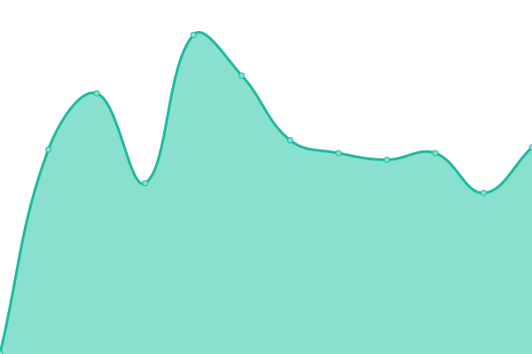 462ms
     
 | 

<a href="https://calponia.github.io/status-page-poc2/history/login">100.00%</a>
    

|  [Platform](https://platform.pantaris.io) | 🟩 Up | [platform.yml](https://github.com/calponia/status-page-poc2/commits/HEAD/history/platform.yml) | 

 468ms
     
 | 

<a href="https://calponia.github.io/status-page-poc2/history/platform">100.00%</a>
    

|  [Organizations](https://organization.pantaris.io) | 🟩 Up | [organizations.yml](https://github.com/calponia/status-page-poc2/commits/HEAD/history/organizations.yml) | 

 448ms
     
 | 

<a href="https://calponia.github.io/status-page-poc2/history/organizations">100.00%</a>
    

|  [Service Portal](https://portal.pantaris.io) | 🟩 Up | [service-portal.yml](https://github.com/calponia/status-page-poc2/commits/HEAD/history/service-portal.yml) | 

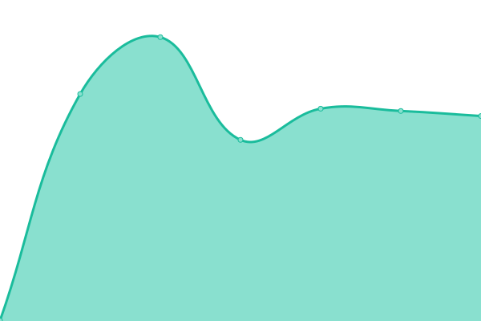 495ms
     
 | 

<a href="https://calponia.github.io/status-page-poc2/history/service-portal">100.00%</a>
    

|  [Marketplace](https://marketplace.pantaris.io) | 🟩 Up | [marketplace.yml](https://github.com/calponia/status-page-poc2/commits/HEAD/history/marketplace.yml) | 

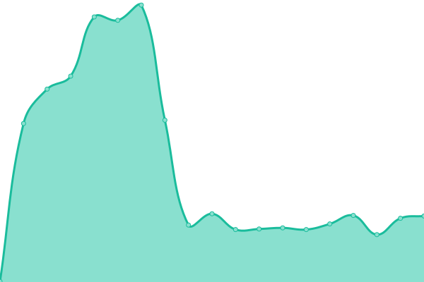 569ms
     
 | 

<a href="https://calponia.github.io/status-page-poc2/history/marketplace">100.00%</a>
    

|  [Documentation](https://documentation.pantaris.io) | 🟩 Up | [documentation.yml](https://github.com/calponia/status-page-poc2/commits/HEAD/history/documentation.yml) | 

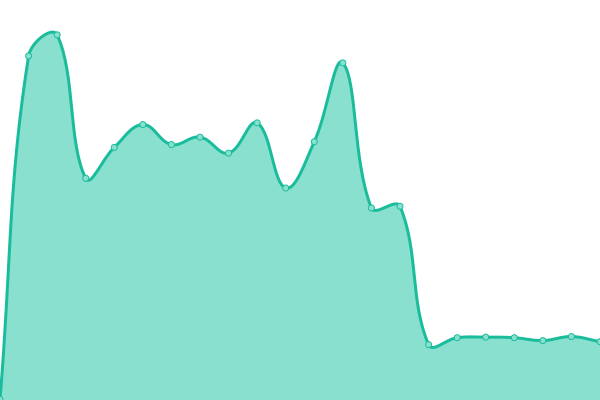 602ms
     
 | 

<a href="https://calponia.github.io/status-page-poc2/history/documentation">100.00%</a>
    

|  [Support](https://helpspot.calponia.com) | 🟩 Up | [support.yml](https://github.com/calponia/status-page-poc2/commits/HEAD/history/support.yml) | 

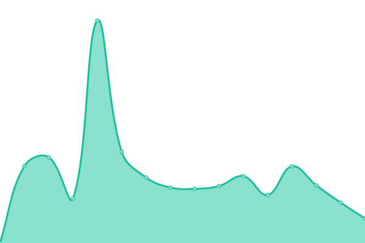 569ms
     
 | 

<a href="https://calponia.github.io/status-page-poc2/history/support">100.00%</a>
    

|  [Forum](https://forum.pantaris.io) | 🟩 Up | [forum.yml](https://github.com/calponia/status-page-poc2/commits/HEAD/history/forum.yml) | 

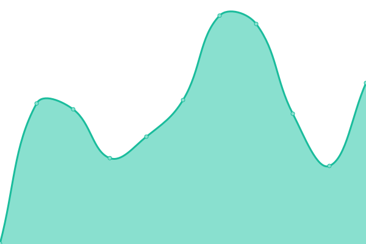 756ms
     
 | 

<a href="https://calponia.github.io/status-page-poc2/history/forum">100.00%</a>
    

|  [Operations](https://management.pantaris.io) | 🟥 Down | [operations.yml](https://github.com/calponia/status-page-poc2/commits/HEAD/history/operations.yml) | 

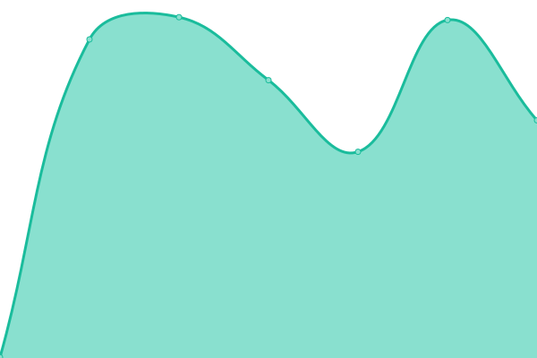 445ms
     
 | 

<a href="https://calponia.github.io/status-page-poc2/history/operations">2.64%</a>
    

|  [CDN](https://cdn.pantaris.io) | 🟩 Up | [cdn.yml](https://github.com/calponia/status-page-poc2/commits/HEAD/history/cdn.yml) | 

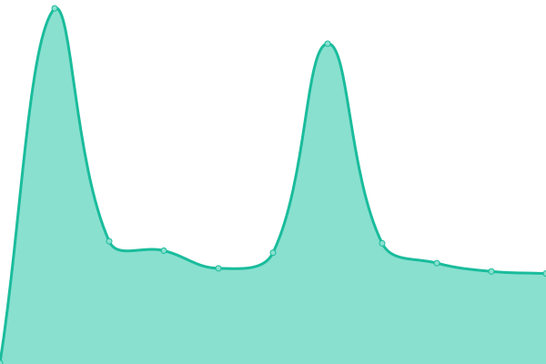 458ms
     
 | 

<a href="https://calponia.github.io/status-page-poc2/history/cdn">100.00%</a>
    

|  [Upload & Webdav Service](https://upload.pantaris.io/healthcheck) | 🟩 Up | [upload-and-webdav-service.yml](https://github.com/calponia/status-page-poc2/commits/HEAD/history/upload-and-webdav-service.yml) | 

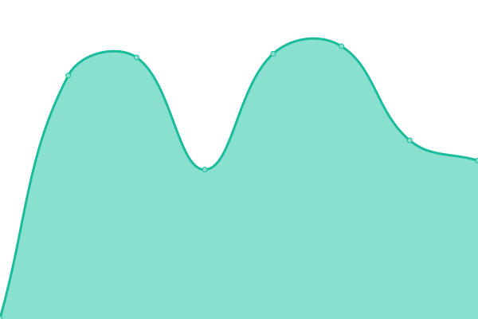 458ms
     
 | 

<a href="https://calponia.github.io/status-page-poc2/history/upload-and-webdav-service">100.00%</a>
    

|  [Download Service](https://download.pantaris.io/healthcheck) | 🟩 Up | [download-service.yml](https://github.com/calponia/status-page-poc2/commits/HEAD/history/download-service.yml) | 

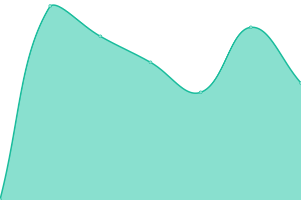 582ms
     
 | 

<a href="https://calponia.github.io/status-page-poc2/history/download-service">100.00%</a>
    

|  [Applications](https://healthcheck.app.pantaris.io) | 🟩 Up | [applications.yml](https://github.com/calponia/status-page-poc2/commits/HEAD/history/applications.yml) | 

 452ms
     
 | 

<a href="https://calponia.github.io/status-page-poc2/history/applications">100.00%</a>
    

|  [External Traffic Service](http://0ca2d4b8f342a21cfb6de71d1d1c46b4.ext.pantaris.io:3001/) | 🟩 Up | [external-traffic-service.yml](https://github.com/calponia/status-page-poc2/commits/HEAD/history/external-traffic-service.yml) | 

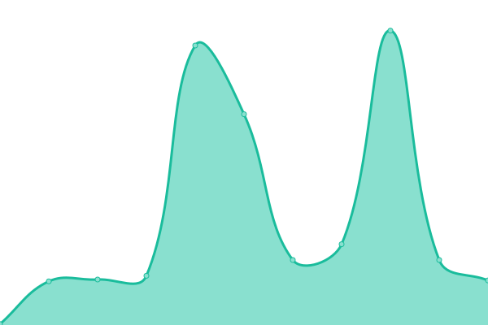 284ms
     
 | 

<a href="https://calponia.github.io/status-page-poc2/history/external-traffic-service">100.00%</a>
    

|  [Docker Registry](https://docker.pantaris.io) | 🟩 Up | [docker-registry.yml](https://github.com/calponia/status-page-poc2/commits/HEAD/history/docker-registry.yml) | 

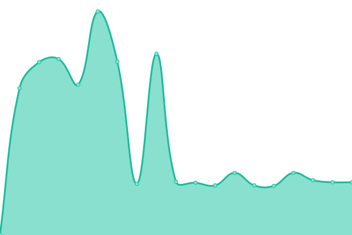 451ms
     
 | 

<a href="https://calponia.github.io/status-page-poc2/history/docker-registry">100.00%</a>
    

|  [API v2](https://api.pantaris.io/v2/healthcheck) | 🟩 Up | [api-v2.yml](https://github.com/calponia/status-page-poc2/commits/HEAD/history/api-v2.yml) | 

 466ms
     
 | 

<a href="https://calponia.github.io/status-page-poc2/history/api-v2">100.00%</a>
    

|  [Message Bus](https://status-gateway.pantaris.io/v1/status/management-rabbitmq) | 🟩 Up | [message-bus.yml](https://github.com/calponia/status-page-poc2/commits/HEAD/history/message-bus.yml) | 

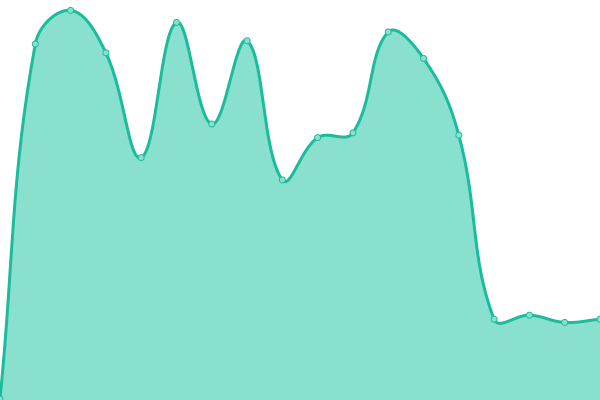 445ms
     
 | 

<a href="https://calponia.github.io/status-page-poc2/history/message-bus">100.00%</a>
    

|  [Logs Monitoring](https://status-gateway.pantaris.io/v1/status/kibana) | 🟩 Up | [logs-monitoring.yml](https://github.com/calponia/status-page-poc2/commits/HEAD/history/logs-monitoring.yml) | 

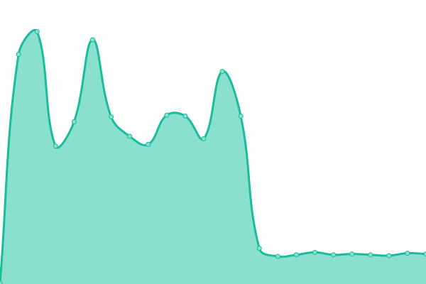 283ms
     
 | 

<a href="https://calponia.github.io/status-page-poc2/history/logs-monitoring">100.00%</a>
    

|  [Metrics Monitoring](https://grafana.mon.pantaris.io) | 🟩 Up | [metrics-monitoring.yml](https://github.com/calponia/status-page-poc2/commits/HEAD/history/metrics-monitoring.yml) | 

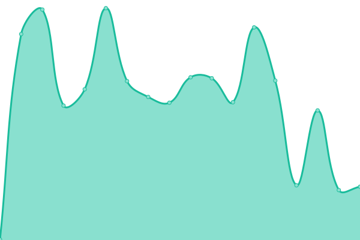 429ms
     
 | 

<a href="https://calponia.github.io/status-page-poc2/history/metrics-monitoring">100.00%</a>
    

<!--end: status pages-->

[**Visit our status website →**](https://calponia.github.io/status-page-poc2)

## 📄 License

- Powered by: [Upptime](https://github.com/upptime/upptime)
- Code: [MIT](./LICENSE) © [Anand Chowdhary](https://anandchowdhary.com), supported by [Pabio](https://pabio.com)
- Data in the `./history` directory: [Open Database License](https://opendatacommons.org/licenses/odbl/1-0/)
